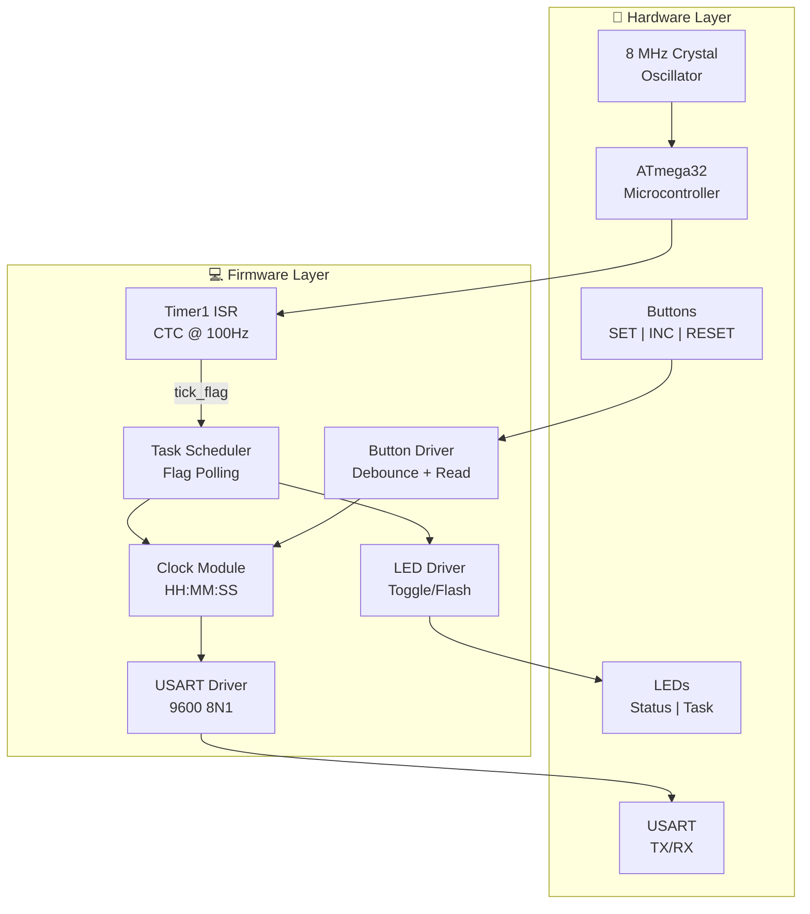
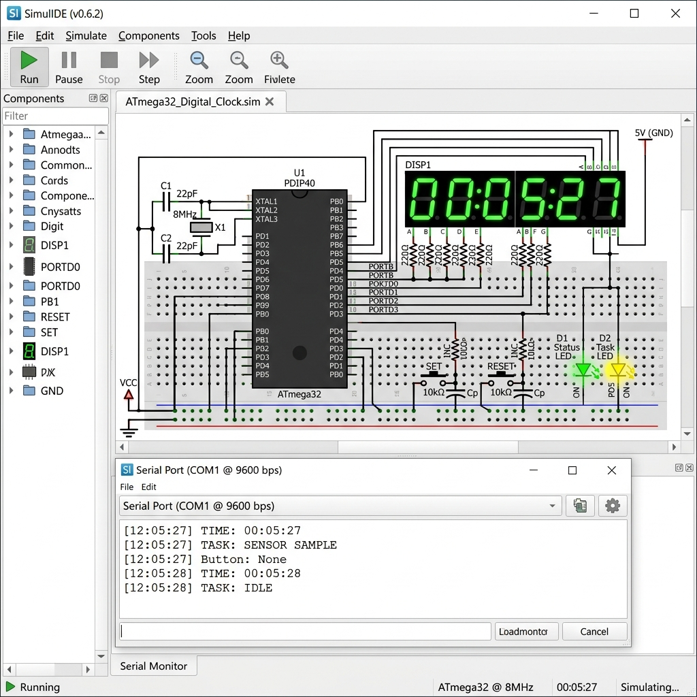
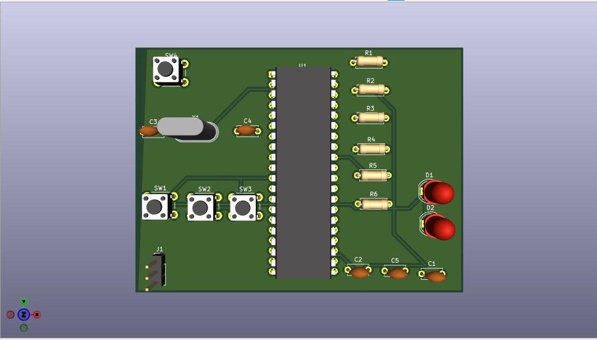

# ⏱️ ATmega32 Timer-Based Digital Clock & Task Scheduler

[](https://www.microchip.com/en-us/product/ATmega32)
[](#hardware-requirements)
[](#license)
[](#software-requirements)

> A precision digital clock and cooperative task scheduler built on the ATmega32 microcontroller, leveraging Timer1 in CTC mode for accurate 100Hz timekeeping with USART-based HH:MM:SS display and multi-task LED scheduling.

---

## 📋 Table of Contents

- [Project Overview](#project-overview)
- [Features](#features)
- [System Architecture](#system-architecture)
- [Hardware Requirements](#hardware-requirements)
- [Software Requirements](#software-requirements)
- [Pin Mapping](#pin-mapping)
- [Build Instructions](#build-instructions)
- [Usage](#usage)
- [Repository Structure](#repository-structure)
- [Screenshots](#screenshots)
- [Documentation](#documentation)
- [License](#license)

---

## 🎯 Project Overview

This project implements a **real-time digital clock** and **cooperative task scheduler** on the **ATmega32** microcontroller running at **8 MHz** with an external crystal oscillator. The system uses **Timer1 in CTC (Clear Timer on Compare Match) mode** with a prescaler of 64 and an OCR1A value of 1249 to generate a precise **100 Hz interrupt**—the heartbeat of the entire system.

The clock displays time in **HH:MM:SS** format via the **USART interface** at 9600 baud, while the task scheduler manages two LED tasks using a **non-blocking, ISR-flag-driven architecture**:

- **Status LED** (PB0): Toggles every **2 seconds**
- **Task LED** (PB1): Flashes every **5 seconds**

Three hardware buttons provide user interaction for time setting, field incrementing, and clock reset—all with internal pull-up resistors and active-low logic.

---

## ✨ Features

| Feature | Description |
|---------|-------------|
| **Precision Timekeeping** | Timer1 CTC mode with 64 prescaler generates accurate 100Hz tick |
| **USART Display** | Real-time HH:MM:SS output at 9600 baud (8N1) |
| **Task Scheduler** | Cooperative, flag-based scheduler with configurable task intervals |
| **Status LED** | Heartbeat indicator toggling every 2 seconds |
| **Task LED** | Periodic flash every 5 seconds for task activity indication |
| **Time Set Mode** | Cycle through HH → MM → SS fields with SET button |
| **Increment Function** | Increment the currently selected time field |
| **Clock Reset** | Instantly reset time to 00:00:00 |
| **Non-Blocking Design** | ISR sets flags only; all processing happens in the main loop |
| **Low Power** | Efficient design suitable for battery-powered operation |

---

## 🏗️ System Architecture

The system follows a **flag-based cooperative scheduling** architecture where the Timer1 ISR sets scheduler flags, and the main loop polls and services those flags. This ensures deterministic behavior with minimal interrupt latency.



### Architecture Principles

1. **ISR Minimalism**: The Timer1 Compare Match ISR only increments a counter and sets boolean flags—no heavy processing inside the ISR.
2. **Flag-Based Scheduling**: The main loop continuously polls scheduler flags and dispatches tasks when their flags are set.
3. **Separation of Concerns**: Clock logic, LED control, button handling, and USART communication are modular and independent.
4. **Non-Blocking I/O**: All operations are non-blocking to maintain responsive button handling and accurate timing.

---

## 🔌 Hardware Requirements

| Component | Specification | Quantity |
|-----------|--------------|----------|
| ATmega32 Microcontroller | PDIP-40 package | 1 |
| Crystal Oscillator | 8 MHz, HC49 package | 1 |
| Load Capacitors | 22 pF ceramic | 2 |
| LEDs | 5mm, any color (Status + Task) | 2 |
| Current Limiting Resistors | 330Ω, ¼W | 2 |
| Tactile Push Buttons | 6mm, normally open | 3 |
| Decoupling Capacitor | 100 nF ceramic | 1 |
| Reset Pull-up Resistor | 10 kΩ | 1 |
| Reset Capacitor | 100 nF ceramic | 1 |
| USB-to-UART Adapter | FTDI/CH340/CP2102 (3.3V/5V) | 1 |
| ISP Programmer | USBasp / AVRISP mkII / Arduino as ISP | 1 |
| Breadboard or PCB | Standard breadboard or custom PCB | 1 |
| Power Supply | 5V DC regulated | 1 |
| Jumper Wires | Male-to-male, assorted | As needed |

### Schematic Overview

```
                        +----[VCC 5V]----+
                        |                |
                   [10kΩ]R1         [100nF]C3
                        |                |
          +-------------+---[RESET]------+---[GND]
          |
    +-----+-----+
    |  ATmega32  |
    |            |
    | PA0 (40)---+---[SET BTN]---[GND]       (Internal Pull-up)
    | PA1 (39)---+---[INC BTN]---[GND]       (Internal Pull-up)
    | PA2 (38)---+---[RST BTN]---[GND]       (Internal Pull-up)
    |            |
    | PB0 (1)----+---[330Ω]---[LED_STATUS]---[GND]
    | PB1 (2)----+---[330Ω]---[LED_TASK]-----[GND]
    |            |
    | PD0 (14)---+---[RXD from UART Adapter]
    | PD1 (15)---+---[TXD to UART Adapter]
    |            |
    | XTAL1(13)--+---[8MHz XTAL]---+---[22pF]---[GND]
    | XTAL2(12)--+---[8MHz XTAL]---+---[22pF]---[GND]
    |            |
    | VCC (10)---+---[5V]    [100nF]---[GND]
    | GND (11)---+---[GND]
    | AVCC(30)---+---[5V]
    | AGND(31)---+---[GND]
    +------------+
```

---

## 💻 Software Requirements

| Tool | Version | Purpose |
|------|---------|---------|
| **AVR-GCC** | ≥ 5.4.0 | C compiler for AVR targets |
| **AVR Libc** | ≥ 2.0.0 | Standard C library for AVR |
| **AVRDUDE** | ≥ 6.3 | Flash programmer utility |
| **GNU Make** | ≥ 4.0 | Build automation |
| **Serial Terminal** | PuTTY / minicom / screen | USART output viewing |

### Installation (Ubuntu/Debian)

```bash
sudo apt-get update
sudo apt-get install gcc-avr avr-libc avrdude make
```

### Installation (macOS with Homebrew)

```bash
brew tap osx-cross/avr
brew install avr-gcc avrdude
```

### Installation (Windows)

Download and install [WinAVR](http://winavr.sourceforge.net/) or use the [Microchip AVR Toolchain](https://www.microchip.com/en-us/tools-resources/develop/microchip-studio/gcc-compilers).

---

## 📌 Pin Mapping

| Pin # | Port/Pin | Function | Direction | Configuration | Description |
|-------|----------|----------|-----------|---------------|-------------|
| 40 | PA0 | SET_BTN | Input | Internal Pull-up | Enter time-set mode / cycle fields |
| 39 | PA1 | INC_BTN | Input | Internal Pull-up | Increment selected time field |
| 38 | PA2 | CLOCK_RESET | Input | Internal Pull-up | Reset clock to 00:00:00 |
| 1 | PB0 | LED_STATUS | Output | Active High | Status heartbeat LED (2s toggle) |
| 2 | PB1 | LED_TASK | Output | Active High | Task indicator LED (5s flash) |
| 6 | PB5 | MOSI | — | ISP Programming | SPI Master Out Slave In |
| 7 | PB6 | MISO | — | ISP Programming | SPI Master In Slave Out |
| 8 | PB7 | SCK | — | ISP Programming | SPI Clock |
| 9 | RESET | RESET | Input | External Pull-up (10kΩ) | Hardware reset with RC filter |
| 10 | VCC | Power | — | +5V DC | Digital supply voltage |
| 11 | GND | Ground | — | 0V | Digital ground |
| 12 | XTAL2 | Crystal | — | 8 MHz + 22pF cap | Crystal oscillator output |
| 13 | XTAL1 | Crystal | — | 8 MHz + 22pF cap | Crystal oscillator input |
| 14 | PD0 | USART_RXD | Input | — | USART Receive Data |
| 15 | PD1 | USART_TXD | Output | — | USART Transmit Data |
| 30 | AVCC | Analog VCC | — | +5V DC | Analog supply voltage |
| 31 | AGND | Analog GND | — | 0V | Analog ground |

> 📖 For the complete 40-pin mapping, see [documentation/pin_mapping_table.md](documentation/pin_mapping_table.md)

---

## 🔨 Build Instructions

### 1. Clone the Repository

```bash
git clone https://github.com/yourusername/atmega32-digital-clock.git
cd atmega32-digital-clock
```

### 2. Configure the Makefile

Verify the following settings in `Makefile`:

```makefile
MCU       = atmega32
F_CPU     = 8000000UL
PROGRAMMER = usbasp
PORT      = usb
BAUD      = 9600
```

### 3. Compile the Project

```bash
make all
```

This will produce `main.hex` in the build directory.

### 4. Set Fuse Bits (First Time Only)

Configure the ATmega32 for an external 8 MHz crystal:

```bash
# Low Fuse:  0xFF (External Crystal, full swing, 16K CK + 64ms startup)
# High Fuse: 0xD9 (JTAG disabled, EEPROM preserved, Boot size 256 words)
avrdude -c usbasp -p m32 -U lfuse:w:0xFF:m -U hfuse:w:0xD9:m
```

> ⚠️ **Warning**: Incorrect fuse settings can brick your microcontroller. Double-check values before programming.

### 5. Flash the Firmware

```bash
make flash
# or manually:
avrdude -c usbasp -p m32 -U flash:w:main.hex:i
```

### 6. Connect Serial Terminal

```bash
# Linux
minicom -D /dev/ttyUSB0 -b 9600

# macOS
screen /dev/cu.usbserial-XXXX 9600

# Windows
# Use PuTTY with COM port at 9600 baud, 8N1
```

### 7. Verify Operation

After programming and connecting the serial terminal, you should see:

```
=====================================
  ATmega32 Digital Clock v1.0
  Timer1 CTC Mode | 8MHz Crystal
=====================================

TIME: 00:00:00
[500ms Tick] Ext Task
TIME: 00:00:01
[500ms Tick] Ext Task
TIME: 00:00:02
[500ms Tick] Ext Task
TIME: 00:00:03
[500ms Tick] Ext Task
TIME: 00:00:04
[500ms Tick] Ext Task
TIME: 00:00:05
TASK: SENSOR SAMPLE
[500ms Tick] Ext Task
...
```

---

## 🕹️ Usage

### Normal Operation

Upon power-up, the clock starts at **00:00:00** and counts up. Time is displayed on the serial terminal every second.

### Button Functions

| Button | Action | Behavior |
|--------|--------|----------|
| **SET** (PA0) | Press | Enters time-set mode. Successive presses cycle: **Hours → Minutes → Seconds → Exit** |
| **INCREMENT** (PA1) | Press | Increments the currently selected field (wraps: 23→0 for hours, 59→0 for min/sec) |
| **RESET** (PA2) | Press | Immediately resets the clock to **00:00:00** |

### LED Indicators

| LED | Port | Behavior |
|-----|------|----------|
| **Status LED** | PB0 | Toggles ON/OFF every **2 seconds** — heartbeat indicator |
| **Task LED** | PB1 | Brief flash every **5 seconds** — scheduled task indicator |

---

## 📁 Repository Structure

```
atmega32-digital-clock/
│
├── README.md                              # This file
├── LICENSE                                # MIT License
│
├── firmware/                              # Firmware source and hex
│   ├── src/                               # C Source files
│   │   ├── main.c                         # Main application entry
│   │   ├── timer.c                        # Timer config and ISR
│   │   ├── display.c                      # USART output logic
│   │   ├── scheduler.c                    # Non-blocking scheduler
│   │   └── buttons.c                      # Button debounce logic
│   ├── include/                           # Header files
│   │   ├── config.h                       # Pin definitions & constants
│   │   ├── timer.h
│   │   ├── display.h
│   │   ├── scheduler.h
│   │   └── buttons.h
│   ├── hex/
│   │   └── main.hex                       # Compiled firmware binary
│   └── Makefile                           # Build configuration
│
├── documentation/                         # Project documentation
│   ├── timer_configuration.md             # Timer1 CTC mode setup
│   ├── compare_match_calculation.md       # OCR1A calculation
│   ├── pin_mapping_table.md               # ATmega32 pin mapping
│   ├── test_results.md                    # Test plan and results
│   ├── block_diagram.md                   # System block diagram
│   └── flowchart.md                       # Program flowchart
│
├── simulide/                              # Simulation files
│   ├── circuit/                           # Simulide circuit docs
│   └── screenshots/                       # Simulation screenshots
│
└── kicad/                                 # Hardware design
    ├── schematic/                         # KiCad schematic
    ├── pcb/                               # KiCad PCB layout
    └── gerber/                            # Manufacturing files
```

---

## 📸 Screenshots

### SimulIDE Simulation Running



### KiCad PCB Layout



---

## 📚 Documentation

Detailed documentation is available in the `documentation/` directory:

| Document | Description |
|----------|-------------|
| [Timer Configuration](documentation/timer_configuration.md) | Detailed Timer1 CTC mode setup and register configuration |
| [Compare Match Calculation](documentation/compare_match_calculation.md) | Step-by-step OCR1A value derivation with accuracy analysis |
| [Pin Mapping Table](documentation/pin_mapping_table.md) | Complete ATmega32 PDIP-40 pin assignment reference |
| [Test Results](documentation/test_results.md) | Test plan, test cases, and verification results |
| [Block Diagram](documentation/block_diagram.md) | System architecture block diagram (Mermaid) |
| [Flowchart](documentation/flowchart.md) | Program flow and ISR logic flowchart (Mermaid) |

---

## 📄 License

This project is licensed under the **MIT License**.

```
MIT License

Copyright (c) 2026 ATmega32 Digital Clock Project

Permission is hereby granted, free of charge, to any person obtaining a copy
of this software and associated documentation files (the "Software"), to deal
in the Software without restriction, including without limitation the rights
to use, copy, modify, merge, publish, distribute, sublicense, and/or sell
copies of the Software, and to permit persons to whom the Software is
furnished to do so, subject to the following conditions:

The above copyright notice and this permission notice shall be included in all
copies or substantial portions of the Software.

THE SOFTWARE IS PROVIDED "AS IS", WITHOUT WARRANTY OF ANY KIND, EXPRESS OR
IMPLIED, INCLUDING BUT NOT LIMITED TO THE WARRANTIES OF MERCHANTABILITY,
FITNESS FOR A PARTICULAR PURPOSE AND NONINFRINGEMENT. IN NO EVENT SHALL THE
AUTHORS OR COPYRIGHT HOLDERS BE LIABLE FOR ANY CLAIM, DAMAGES OR OTHER
LIABILITY, WHETHER IN AN ACTION OF CONTRACT, TORT OR OTHERWISE, ARISING FROM,
OUT OF OR IN CONNECTION WITH THE SOFTWARE OR THE USE OR OTHER DEALINGS IN THE
SOFTWARE.
```

---

<p align="center">
  <b>Built with ❤️ for embedded systems enthusiasts</b><br>
  ATmega32 · Timer1 CTC · USART · Cooperative Scheduling
</p>
