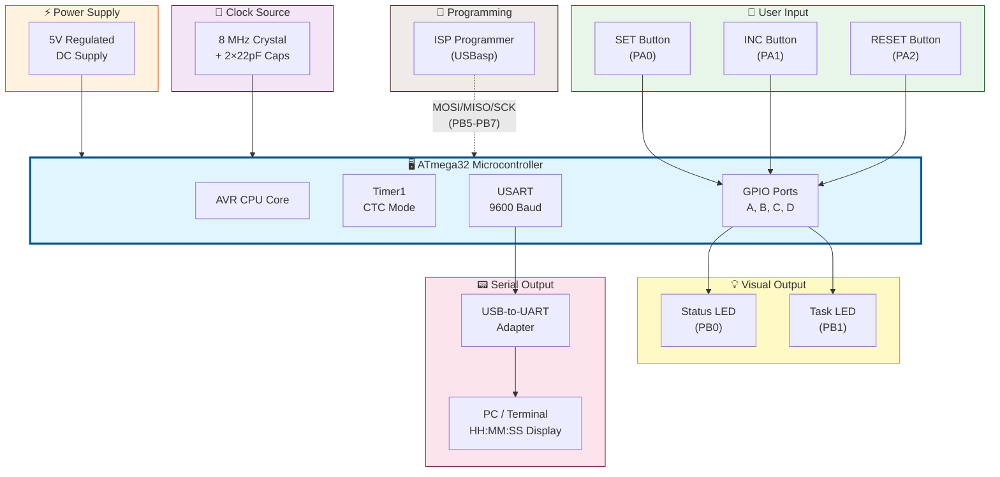
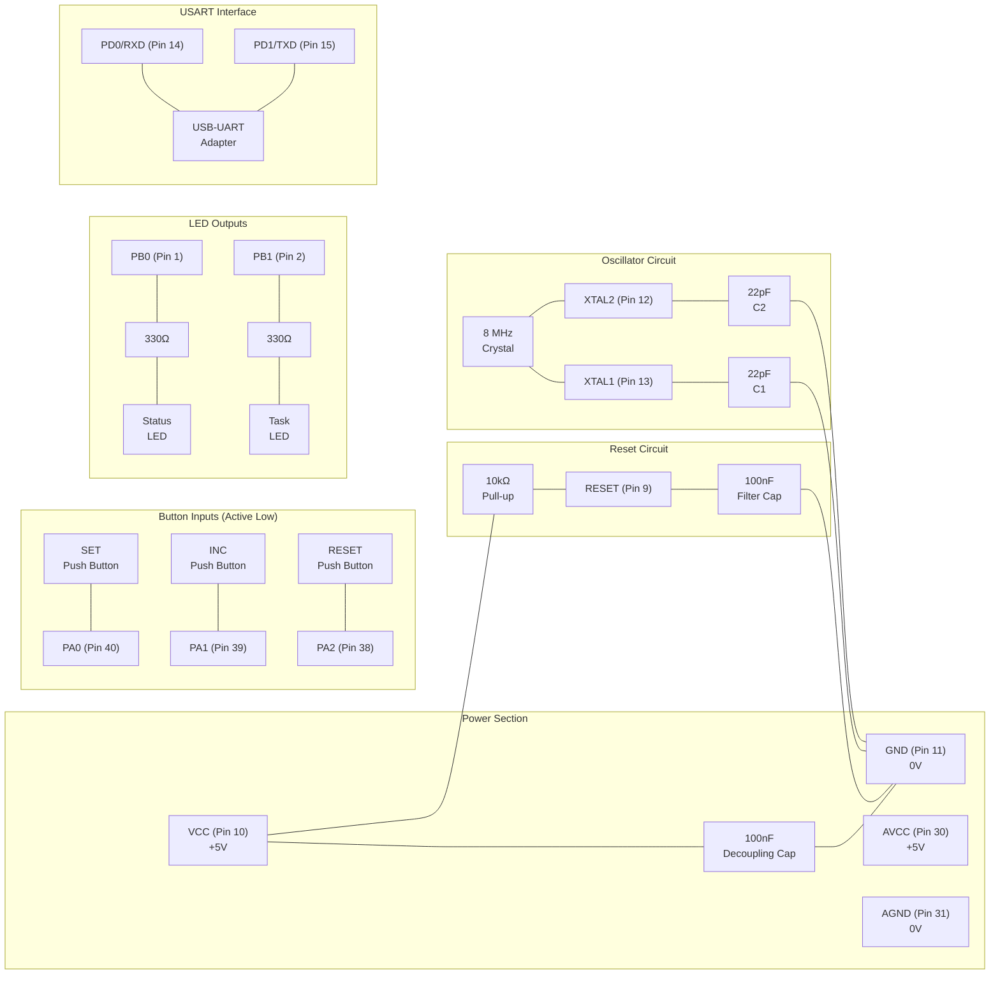
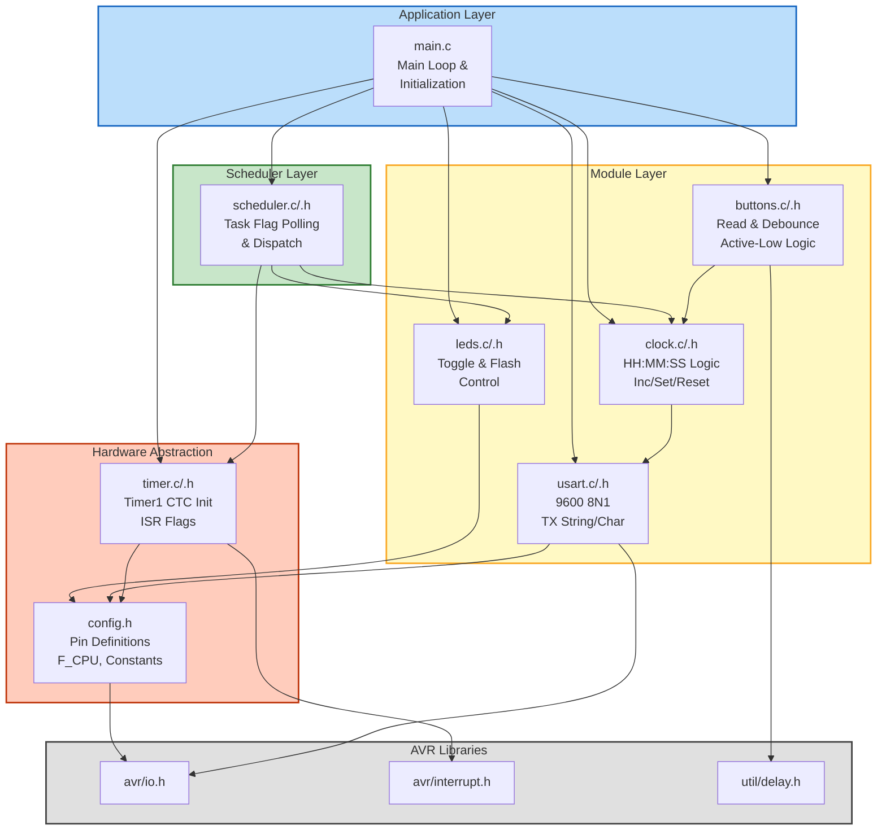
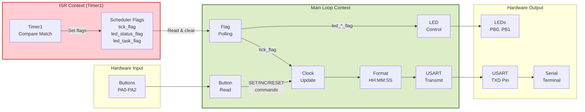
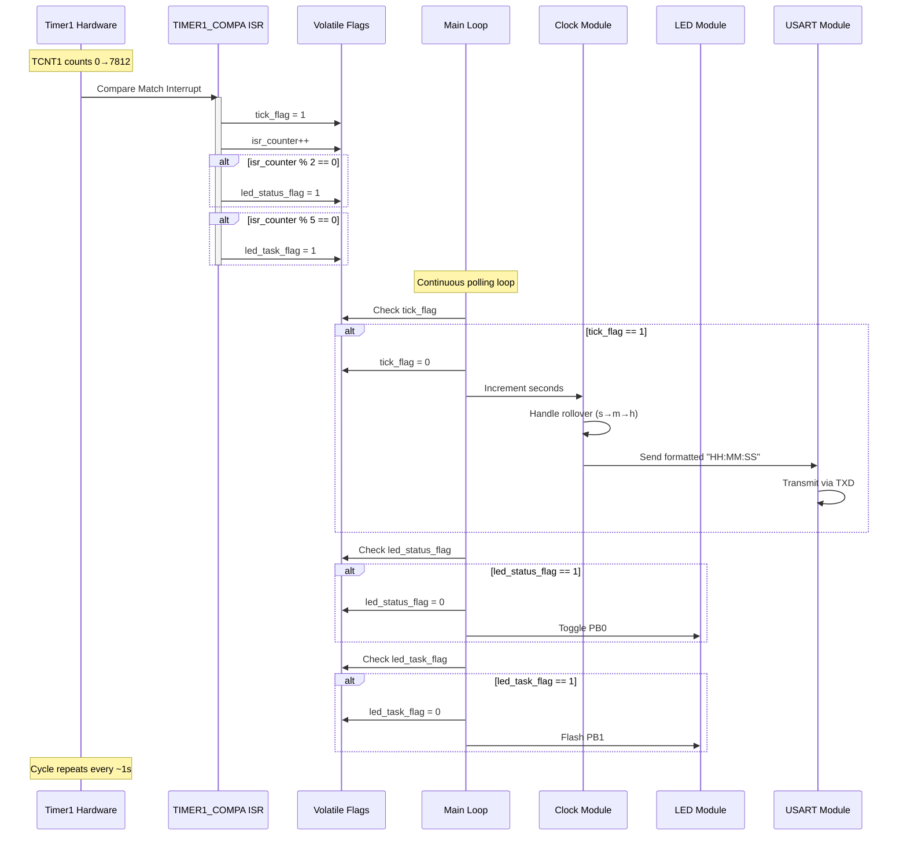

# 📊 System Block Diagram

> Visual representation of the ATmega32 Digital Clock & Task Scheduler system architecture, including hardware blocks, firmware modules, and signal flow.

---

## Table of Contents

- [High-Level System Block Diagram](#high-level-system-block-diagram)
- [Hardware Block Diagram](#hardware-block-diagram)
- [Firmware Architecture Diagram](#firmware-architecture-diagram)
- [Data Flow Diagram](#data-flow-diagram)
- [Interrupt and Scheduler Flow](#interrupt-and-scheduler-flow)
- [Signal Path Descriptions](#signal-path-descriptions)

---

## High-Level System Block Diagram

This diagram shows the complete system at the highest level of abstraction:



---

## Hardware Block Diagram

This diagram details the physical hardware connections and electrical interfaces:



---

## Firmware Architecture Diagram

This diagram shows the software module hierarchy and dependencies:



---

## Data Flow Diagram

This diagram traces the flow of data through the system:



---

## Interrupt and Scheduler Flow

This diagram details how the ISR and main-loop scheduler interact:



---

## Signal Path Descriptions

### Clock Signal Path

```
8 MHz Crystal → XTAL1/XTAL2 → System Clock (clk_IO)
    → Prescaler (/1024) → Timer1 Clock (7812.5 Hz)
    → TCNT1 counts 0→7812 → Compare Match
    → OCF1A Flag → ISR → tick_flag
    → Main Loop → Clock Module → USART TX → Terminal
```

### Button Signal Path

```
User Press → Button closes to GND → PA0/PA1/PA2 reads LOW
    → Software polls PINx register → Debounce delay
    → Command decoded (SET/INC/RESET)
    → Clock Module updates time fields
    → Updated time sent to USART
```

### LED Signal Path

```
Timer1 ISR → Scheduler flag (led_status_flag / led_task_flag)
    → Main Loop detects flag → LED Module called
    → PORTx bit toggled/set → GPIO pin drives HIGH
    → 330Ω resistor → LED → GND (current flows, LED lights)
```

### ISP Programming Path

```
PC (avrdude) → USB → USBasp Programmer
    → SPI Bus: MOSI (PB5), MISO (PB6), SCK (PB7), RESET
    → ATmega32 Flash memory programmed
```

---

## Legend

| Symbol | Meaning |
|--------|---------|
| Solid arrow (→) | Data/signal flow |
| Dashed arrow (-.->)| Programming/debug connection |
| Blue block | Core/application layer |
| Green block | Scheduler/logic layer |
| Yellow block | Functional modules |
| Red/orange block | Hardware drivers |
| Gray block | External libraries |

---

*← Back to [Test Results](test_results.md) | Next: [Flowchart](flowchart.md) →*
