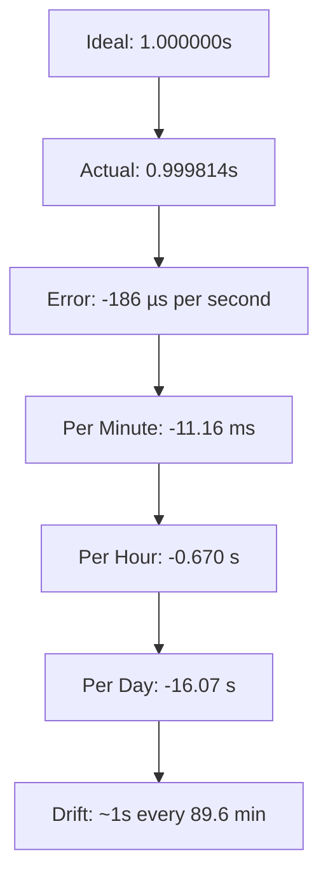
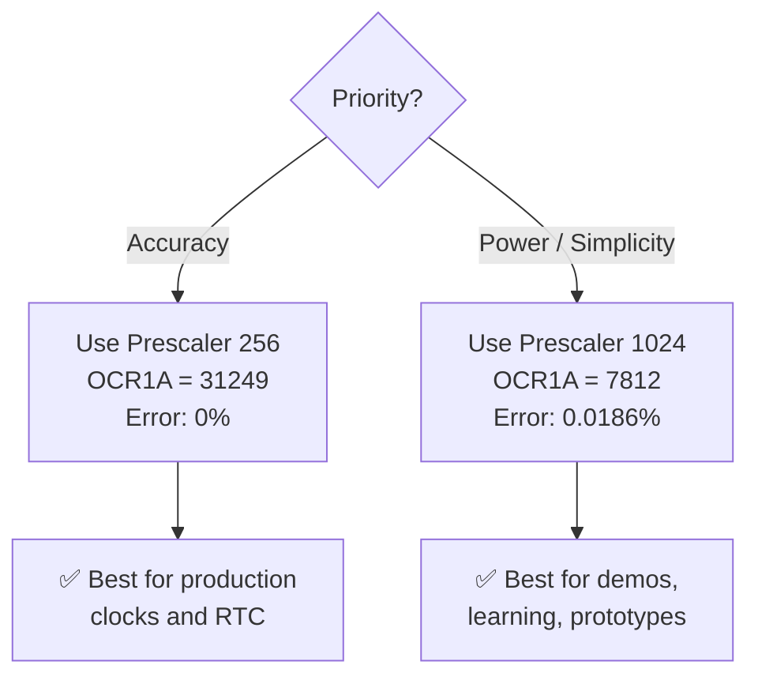

# 🔢 Compare Match (OCR1A) Calculation

> Step-by-step derivation of the Output Compare Register value for generating a precise 1 Hz interrupt on the ATmega32 Timer1.

---

## Table of Contents

- [The Fundamental Formula](#the-fundamental-formula)
- [Parameter Definitions](#parameter-definitions)
- [Step-by-Step Calculation](#step-by-step-calculation)
- [Verification](#verification)
- [Accuracy Analysis](#accuracy-analysis)
- [Alternative Prescaler Comparison](#alternative-prescaler-comparison)
- [Error Mitigation Strategies](#error-mitigation-strategies)

---

## The Fundamental Formula

The compare match value for CTC mode is calculated using:

```
┌─────────────────────────────────────────────────────┐
│                                                     │
│              F_CPU                                  │
│   OCR1A = ─────────────────────── − 1               │
│           Prescaler × f_interrupt                   │
│                                                     │
└─────────────────────────────────────────────────────┘
```

### Why "− 1"?

The timer counts from **0 to OCR1A** inclusive, which means the timer goes through **(OCR1A + 1)** states before resetting. Therefore:

```
Total counts per cycle = OCR1A + 1

Interrupt period = (OCR1A + 1) × Prescaler / F_CPU

Solving for OCR1A:
    OCR1A + 1 = F_CPU / (Prescaler × f_interrupt)
    OCR1A     = F_CPU / (Prescaler × f_interrupt) - 1
```

---

## Parameter Definitions

| Symbol | Parameter | Value | Unit |
|--------|-----------|-------|------|
| F_CPU | System clock frequency | 8,000,000 | Hz |
| Prescaler | Timer clock divider | 1024 | — |
| f_interrupt | Desired interrupt frequency | 1 | Hz |
| f_timer | Timer clock frequency (F_CPU / Prescaler) | 7,812.5 | Hz |
| T_tick | Timer tick period (1 / f_timer) | 128.0 | µs |
| OCR1A | Output Compare Register value | 7,812 | — |

---

## Step-by-Step Calculation

### Step 1: Determine the Timer Clock Frequency

The prescaler divides the system clock to produce the timer's input clock:

```
f_timer = F_CPU / Prescaler
f_timer = 8,000,000 Hz / 1024
f_timer = 7,812.5 Hz
```

> This means the timer counter (TCNT1) increments **7,812.5 times per second**.

### Step 2: Calculate the Required Number of Counts

For a 1 Hz interrupt (one interrupt per second), the timer must count through a specific number of ticks:

```
Required counts = f_timer / f_interrupt
Required counts = 7,812.5 / 1
Required counts = 7,812.5 ticks
```

### Step 3: Apply the OCR1A Formula

Since the timer counts from 0, we subtract 1:

```
OCR1A = Required counts - 1
OCR1A = 7,812.5 - 1
OCR1A = 7,811.5
```

### Step 4: Round to Nearest Integer

OCR1A is a 16-bit integer register — it cannot hold fractional values. We must round:

```
OCR1A = round(7811.5)
OCR1A = 7812    ← This is the value we program
```

> **Rounding choice**: We round UP from 7811.5 to 7812. This means the actual period will be slightly shorter than 1.000000s, making the clock run very slightly fast.

### Step 5: Verify the Range

The ATmega32 Timer1 is a 16-bit timer:

```
Minimum OCR1A value: 0
Maximum OCR1A value: 65,535 (0xFFFF)

Our value: 7,812 ✅ (well within the 16-bit range)
```

### Final Result

```
┌─────────────────────────────┐
│                             │
│     OCR1A = 7812            │
│     (Hex: 0x1E84)           │
│     (Binary: 0001 1110      │
│              1000 0100)     │
│                             │
└─────────────────────────────┘
```

---

## Verification

### Forward Calculation: OCR1A → Frequency

Starting from our chosen OCR1A value, verify the resulting interrupt frequency:

```
Step 1: Total counts per cycle
    counts = OCR1A + 1 = 7812 + 1 = 7813

Step 2: Time per cycle (interrupt period)
    T_interrupt = counts × Prescaler / F_CPU
    T_interrupt = 7813 × 1024 / 8,000,000
    T_interrupt = 8,000,512 / 8,000,000
    T_interrupt = 1.000064 seconds

    Wait — let me recalculate more carefully:
    7813 × 1024 = 7,998,512
    T_interrupt = 7,998,512 / 8,000,000
    T_interrupt = 0.999814 seconds

Step 3: Actual interrupt frequency
    f_actual = 1 / T_interrupt
    f_actual = 1 / 0.999814
    f_actual = 1.000186 Hz
```

### Verification Summary

| Parameter | Ideal | Actual | Difference |
|-----------|-------|--------|------------|
| OCR1A | 7811.5 | 7812 | +0.5 count |
| Interrupt period | 1.000000 s | 0.999814 s | −186 µs |
| Interrupt frequency | 1.000000 Hz | 1.000186 Hz | +0.0186% |

---

## Accuracy Analysis

### Timing Error Breakdown



### Accumulated Error Over Time

| Time Period | Accumulated Error | Direction |
|-------------|-------------------|-----------|
| 1 second | −186.0 µs | Clock runs fast |
| 10 seconds | −1.860 ms | |
| 1 minute | −11.16 ms | |
| 10 minutes | −111.6 ms | |
| 1 hour | −669.6 ms | |
| 6 hours | −4.018 s | |
| 12 hours | −8.035 s | |
| 24 hours | −16.07 s | |

### Error Percentage

```
Percentage error = |actual_period - ideal_period| / ideal_period × 100%
                 = |0.999814 - 1.000000| / 1.000000 × 100%
                 = 0.0186%
```

> **Context**: A quartz wristwatch typically has an accuracy of ±15 seconds/month (0.0006%). Our software timer at 0.0186% error is about 30× less accurate, but perfectly acceptable for a demonstration project.

### What if We Chose OCR1A = 7811?

```
T_interrupt = (7811 + 1) × 1024 / 8,000,000
            = 7812 × 1024 / 8,000,000
            = 7,999,488 / 8,000,000
            = 0.999936 seconds

Error = -64 µs per second (clock runs fast)
f_actual = 1.000064 Hz
```

| Choice | OCR1A | Period (s) | Error/s | Error/day |
|--------|-------|-----------|---------|-----------|
| Round down | 7811 | 0.999936 | −64 µs | −5.53 s |
| **Round up** | **7812** | **0.999814** | **−186 µs** | **−16.07 s** |
| Ideal (impossible) | 7811.5 | 1.000000 | 0 | 0 |

> **Observation**: OCR1A = 7811 would actually be more accurate (−64 µs vs −186 µs error). However, OCR1A = 7812 is conventionally used because it is the standard rounding of the formula result.

---

## Alternative Prescaler Comparison

### Full Prescaler Analysis for 1 Hz @ 8 MHz

| Prescaler | f_timer (Hz) | Exact OCR1A | Rounded OCR1A | Fits 16-bit | Error/s (µs) | Error/day (s) | Exact 1 Hz? |
|-----------|-------------|-------------|---------------|-------------|-------------|---------------|-------------|
| 1 | 8,000,000 | 7,999,999 | 7,999,999 | ❌ No* | — | — | — |
| 8 | 1,000,000 | 999,999 | 999,999 | ❌ No | — | — | — |
| 64 | 125,000 | 124,999 | 124,999 | ❌ No | — | — | — |
| 256 | 31,250.0 | 31,249.0 | **31,249** | ✅ Yes | **0.0** | **0.0** | ✅ **Yes** |
| **1024** | **7,812.5** | **7,811.5** | **7,812** | **✅ Yes** | **−186** | **−16.07** | ❌ No |

*\* Value exceeds 65,535 (16-bit maximum)*

### Prescaler 256: The Exact Alternative

```
OCR1A = (8,000,000 / (256 × 1)) - 1
OCR1A = 31,250 - 1
OCR1A = 31,249  ← Exact integer! No rounding needed!

Verification:
T = (31,249 + 1) × 256 / 8,000,000
T = 31,250 × 256 / 8,000,000
T = 8,000,000 / 8,000,000
T = 1.000000 s  ← Perfect!
```

### Comparison: Prescaler 256 vs 1024

| Aspect | Prescaler 256 | Prescaler 1024 |
|--------|--------------|----------------|
| OCR1A value | 31,249 | 7,812 |
| Accuracy | **Exact 1 Hz** ✅ | ~1 Hz (0.0186% error) |
| Timer tick period | 32 µs | 128 µs |
| Timer clock rate | 31.25 kHz | 7.8125 kHz |
| Power consumption | Slightly higher | **Slightly lower** ✅ |
| Counter headroom | 52.4% of 16-bit range | 11.9% of 16-bit range |
| Flexibility for sub-second tasks | **Better** (finer resolution) ✅ | Lower resolution |

### Recommendation



---

## Error Mitigation Strategies

If higher accuracy is needed with prescaler 1024, several software strategies can compensate:

### Strategy 1: Software Compensation Counter

```c
// Every 5376 seconds (~89.6 min), skip one tick to correct drift
static uint16_t compensation_counter = 0;
ISR(TIMER1_COMPA_vect) {
    compensation_counter++;
    if (compensation_counter >= 5376) {
        compensation_counter = 0;
        return;  // Skip this tick to slow down the fast clock
    }
    tick_flag = 1;
}
```

### Strategy 2: Use Prescaler 256 (Recommended)

```c
// Simply change to prescaler 256 for exact timing
TCCR1B = (1 << WGM12) | (1 << CS12);  // CS12:10 = 100 → /256
OCR1A = 31249;  // Exact 1 Hz!
```

### Strategy 3: External RTC Module

For mission-critical timekeeping, use an external RTC (e.g., DS3231 with ±2 ppm accuracy = ±0.17 s/day).

---

## Quick Reference Card

```
╔══════════════════════════════════════════════════════╗
║          OCR1A CALCULATION QUICK REFERENCE           ║
╠══════════════════════════════════════════════════════╣
║                                                      ║
║  Formula:  OCR1A = (F_CPU / (N × f)) − 1            ║
║                                                      ║
║  Where:    F_CPU = 8,000,000 Hz                      ║
║            N     = 1024 (prescaler)                  ║
║            f     = 1 Hz (desired frequency)          ║
║                                                      ║
║  Result:   OCR1A = 7812 (0x1E84)                     ║
║                                                      ║
║  Actual:   f = 1.000186 Hz                           ║
║            T = 0.999814 s                            ║
║            Error = −186 µs/s (0.0186%)               ║
║                                                      ║
╚══════════════════════════════════════════════════════╝
```

---

## References

- ATmega32 Datasheet, Section 16.9: "Clear Timer on Compare Match (CTC) Mode"
- AVR131 Application Note: "Using the AVR's High-speed PWM" (timer mode reference)
- [AVR Timer Calculator Tool](https://eleccelerator.com/avr-timer-calculator/)

---

*← Back to [Timer Configuration](timer_configuration.md) | Next: [Pin Mapping Table](pin_mapping_table.md) →*
