# 🔄 Program Flowcharts

> Detailed flowcharts illustrating the program logic, interrupt service routine, clock update algorithm, button handling state machine, and task scheduler for the ATmega32 Digital Clock & Task Scheduler.

---

## Table of Contents

- [Main Program Flowchart](#main-program-flowchart)
- [System Initialization Flowchart](#system-initialization-flowchart)
- [Timer1 ISR Flowchart](#timer1-isr-flowchart)
- [Clock Update Algorithm](#clock-update-algorithm)
- [Time-Set Mode State Machine](#time-set-mode-state-machine)
- [Task Scheduler Flowchart](#task-scheduler-flowchart)
- [USART Transmission Flowchart](#usart-transmission-flowchart)
- [Button Read and Debounce Flowchart](#button-read-and-debounce-flowchart)

---

## Main Program Flowchart

The top-level program flow from power-on through the infinite main loop:

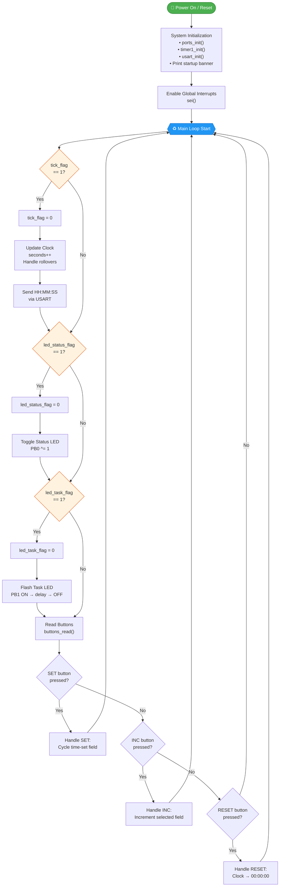

---

## System Initialization Flowchart

Detailed initialization sequence executed once at startup:

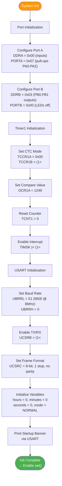

---

## Timer1 ISR Flowchart

The interrupt service routine that fires every ~1 second:

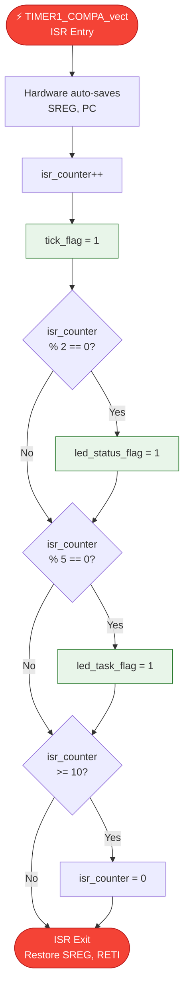

### ISR Execution Timeline

```mermaid
gantt
    title ISR Flag Setting Over 10 Seconds
    dateFormat X
    axisFormat %s

    section tick_flag
    t=1s  :a1, 1, 2
    t=2s  :a2, 2, 3
    t=3s  :a3, 3, 4
    t=4s  :a4, 4, 5
    t=5s  :a5, 5, 6
    t=6s  :a6, 6, 7
    t=7s  :a7, 7, 8
    t=8s  :a8, 8, 9
    t=9s  :a9, 9, 10
    t=10s :a10, 10, 11

    section led_status_flag
    t=2s  :crit, b1, 2, 3
    t=4s  :crit, b2, 4, 5
    t=6s  :crit, b3, 6, 7
    t=8s  :crit, b4, 8, 9
    t=10s :crit, b5, 10, 11

    section led_task_flag
    t=5s  :active, c1, 5, 6
    t=10s :active, c2, 10, 11
```

---

## Clock Update Algorithm

The step-by-step process for updating the HH:MM:SS clock:

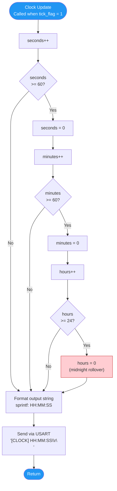

### Clock Value Ranges

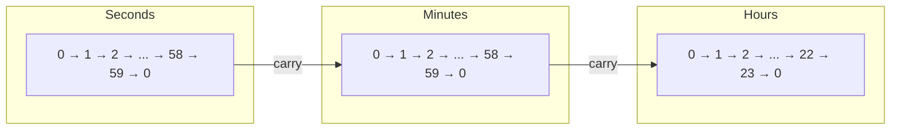

---

## Time-Set Mode State Machine

The SET button cycles through a state machine for setting the time:

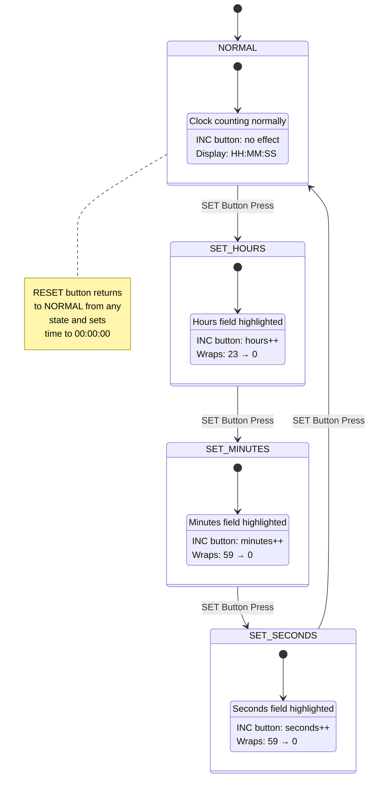

### State Transition Table

| Current State | SET Pressed | INC Pressed | RESET Pressed |
|--------------|-------------|-------------|---------------|
| **NORMAL** | → SET_HOURS | No effect | Reset to 00:00:00 |
| **SET_HOURS** | → SET_MINUTES | hours++ (wrap 23→0) | Reset to 00:00:00, → NORMAL |
| **SET_MINUTES** | → SET_SECONDS | minutes++ (wrap 59→0) | Reset to 00:00:00, → NORMAL |
| **SET_SECONDS** | → NORMAL | seconds++ (wrap 59→0) | Reset to 00:00:00, → NORMAL |

### State Implementation

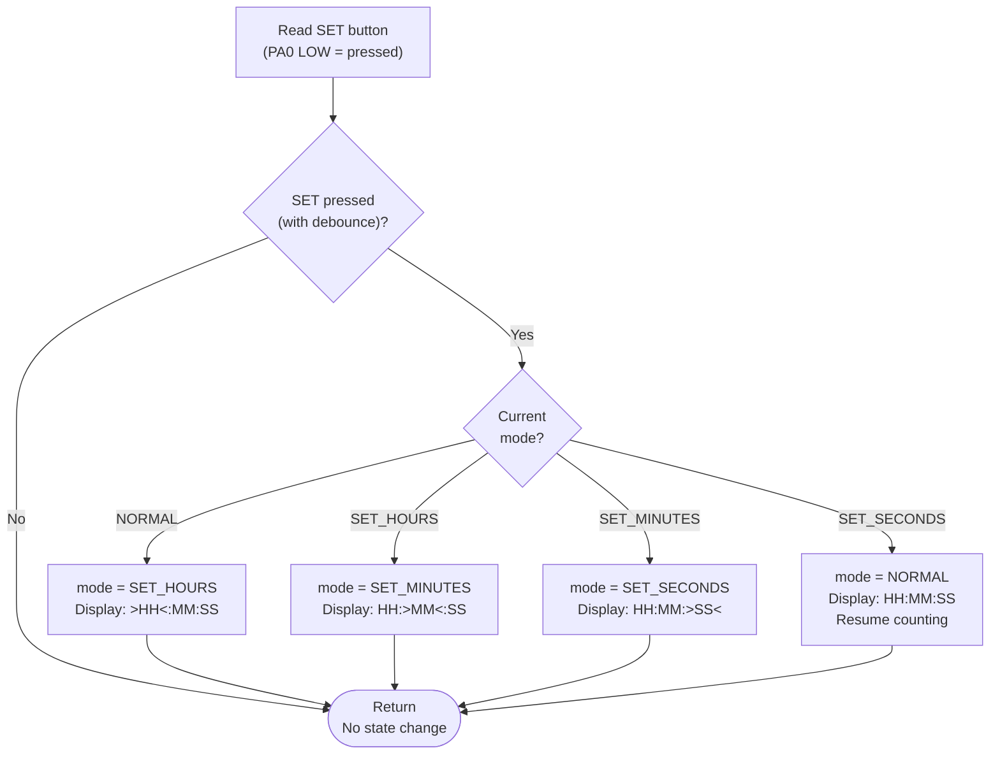

---

## Task Scheduler Flowchart

The cooperative task scheduler main loop logic:

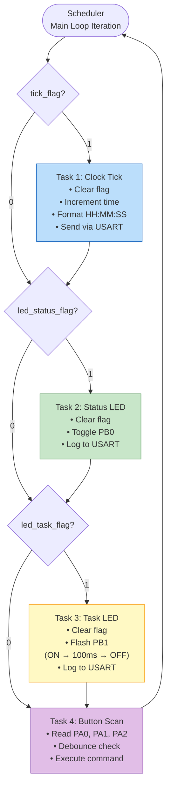

### Task Priority and Timing

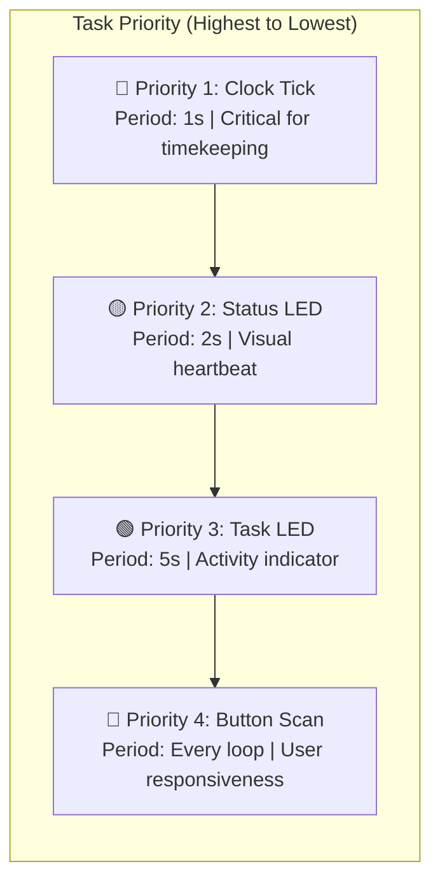

---

## USART Transmission Flowchart

The process for transmitting a single character and a formatted time string:

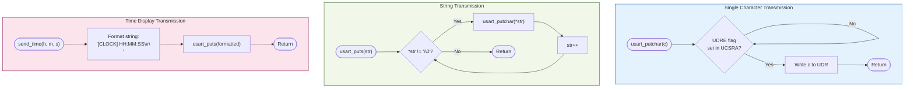

### USART Configuration Summary

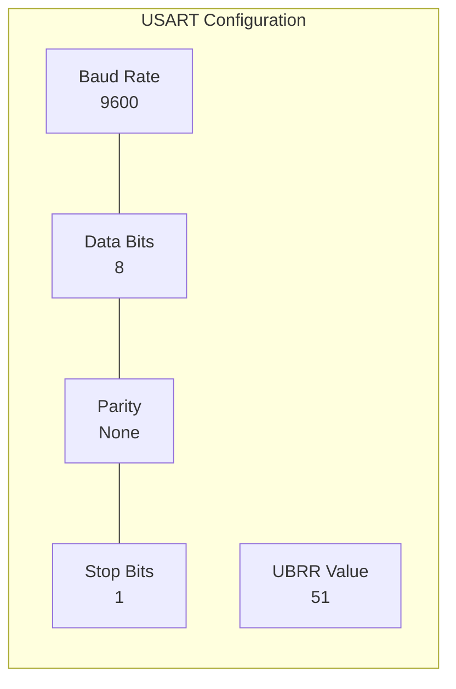

**UBRR Calculation:**
```
UBRR = (F_CPU / (16 × BAUD)) - 1
UBRR = (8,000,000 / (16 × 9600)) - 1
UBRR = (8,000,000 / 153,600) - 1
UBRR = 52.08 - 1
UBRR = 51
```

---

## Button Read and Debounce Flowchart

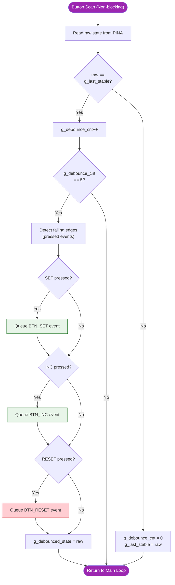

---

## Complete System Timing Diagram

A combined view of all system events over a 10-second window:

```
Time (s):  0    1    2    3    4    5    6    7    8    9   10
           |    |    |    |    |    |    |    |    |    |    |
Clock:     00   01   02   03   04   05   06   07   08   09   10
           ├────┤────┤────┤────┤────┤────┤────┤────┤────┤────┤

Status     OFF  OFF  ON   ON   OFF  OFF  ON   ON   OFF  OFF  ON
LED(PB0):  ─────┘    └────┘    └────┘    └────┘    └────┘    └──
                ↑         ↑         ↑         ↑         ↑
              toggle    toggle    toggle    toggle    toggle
              (t=2)     (t=4)     (t=6)     (t=8)     (t=10)

Task       OFF  OFF  OFF  OFF  OFF  ██   OFF  OFF  OFF  OFF  ██
LED(PB1):  ──────────────────────┘  └──────────────────────┘  └─
                                ↑                          ↑
                              flash                      flash
                              (t=5)                      (t=10)

ISR_CTR:   1    2    3    4    5    6    7    8    9   10→0  1
```

---

*← Back to [Block Diagram](block_diagram.md) | Return to [README](../README.md) →*
