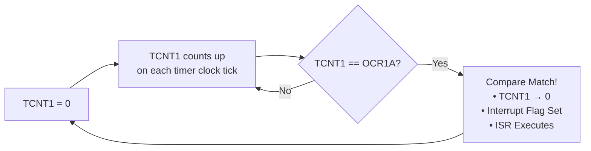

# ⏱️ Timer1 Configuration — CTC Mode

> Detailed documentation of the ATmega32 Timer1 configuration for generating a precise 100 Hz (10 ms) interrupt using Clear Timer on Compare Match (CTC) mode.

---

## Table of Contents

- [Overview](#overview)
- [Timer1 CTC Mode Explanation](#timer1-ctc-mode-explanation)
- [Prescaler Selection Rationale](#prescaler-selection-rationale)
- [OCR1A Value Calculation](#ocr1a-value-calculation)
- [Register Configuration](#register-configuration)
- [Interrupt Timing Analysis](#interrupt-timing-analysis)
- [Initialization Code](#initialization-code)
- [ISR Implementation](#isr-implementation)

---

## Overview

The ATmega32's **16-bit Timer/Counter1** is configured in **CTC (Clear Timer on Compare Match) mode** to generate a precise **100 Hz (10 ms) interrupt signal**. This interrupt serves as the master clock tick for the digital clock and task scheduler.

### Key Parameters

| Parameter | Value |
|-----------|-------|
| System Clock (F_CPU) | 8,000,000 Hz (8 MHz) |
| Timer Mode | CTC (Mode 4) |
| Prescaler | 64 |
| Timer Clock (f_timer) | 125,000 Hz |
| OCR1A Value | 1249 |
| Interrupt Frequency | 100.000 Hz (Exact) |
| Timer Resolution | 16-bit (0–65535) |

---

## Timer1 CTC Mode Explanation

### What is CTC Mode?

In **CTC (Clear Timer on Compare Match)** mode, the timer counter register (TCNT1) counts up from 0 and is automatically cleared (reset to 0) when it matches the value stored in the Output Compare Register (OCR1A). This creates a precisely repeatable waveform.



### Timer1 Count Sequence in CTC Mode

```
Timer Clock Ticks:  0 → 1 → 2 → 3 → ... → 1248 → 1249 → 0 → 1 → 2 → ...
                                                        ↑
                                               Compare Match!
                                               TCNT1 cleared to 0
                                               OCF1A flag set
                                               ISR(TIMER1_COMPA_vect) fires
```

The timer counts from **0 to 1249** (inclusive), which is **1250 timer clock ticks** per cycle.

---

## Prescaler Selection Rationale

The ATmega32's system clock runs at **8 MHz**. To generate a 100 Hz interrupt, we divide the 8 MHz clock using a prescaler.

```
f_timer = F_CPU / Prescaler
f_timer = 8,000,000 Hz / 64
f_timer = 125,000 Hz
```

This ensures the counter ticks 125,000 times per second. 

---

## OCR1A Value Calculation

To achieve exactly 100 Hz, we need the timer to interrupt 100 times per second. 

```
Required ticks = f_timer / desired_frequency
Required ticks = 125,000 / 100 = 1,250 ticks per interrupt
```

Since the timer counts from 0, the final OCR1A value is:
`OCR1A = 1250 - 1 = 1249`

This provides a mathematically perfect 10 ms (100 Hz) interrupt.

---

## Register Configuration

| Register | Bit(s) | Value | Description |
|----------|--------|-------|-------------|
| **TCCR1B** | WGM12 | 1 | Enable CTC Mode |
| **TCCR1B** | CS11, CS10 | 1, 1 | Set Prescaler to 64 |
| **TIMSK** | OCIE1A | 1 | Enable Compare Match A Interrupt |
| **OCR1A** | 15:0 | 1249 | Top value for timer |

---

## Initialization Code

```c
void timer1_init(void)
{
    // 1. Set CTC mode (Clear Timer on Compare Match)
    TCCR1B |= (1 << WGM12);

    // 2. Set OCR1A compare value for 100 Hz (10 ms)
    OCR1AH = (uint8_t)(1249 >> 8);
    OCR1AL = (uint8_t)(1249 & 0xFF);

    // 3. Enable Timer1 Compare Match A Interrupt
    TIMSK |= (1 << OCIE1A);

    // 4. Set prescaler to 64 and start timer
    TCCR1B |= (1 << CS11) | (1 << CS10);
}
```

## ISR Implementation

The ISR simply increments a tick counter. To prevent heavy logic from blocking interrupts, all business logic (clock incrementing, LED toggling) is executed cooperatively in the main loop polling the `timer1_tick_pending()` flag.

```c
ISR(TIMER1_COMPA_vect)
{
    g_timer1_tick = true;
}
```
