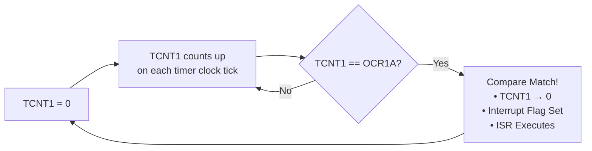

# ⏱️ Timer1 Configuration — CTC Mode

> Detailed documentation of the ATmega32 Timer1 configuration for generating a precise 100 Hz interrupt using Clear Timer on Compare Match (CTC) mode.

---

## Table of Contents

- [Overview](#overview)
- [Timer1 CTC Mode Explanation](#timer1-ctc-mode-explanation)
- [Prescaler Selection Rationale](#prescaler-selection-rationale)
- [OCR1A Value Calculation](#ocr1a-value-calculation)
- [Register Configuration](#register-configuration)
- [Interrupt Timing Analysis](#interrupt-timing-analysis)
- [Initialization Code](#initialization-code)
- [ISR Implementation](#isr-implementation)

---

## Overview

The ATmega32's **16-bit Timer/Counter1** is configured in **CTC (Clear Timer on Compare Match) mode** to generate a precise **100 Hz interrupt signal**. This interrupt serves as the master clock tick for the digital clock and task scheduler.

### Key Parameters

| Parameter | Value |
|-----------|-------|
| System Clock (F_CPU) | 8,000,000 Hz (8 MHz) |
| Timer Mode | CTC (Mode 4) |
| Prescaler | 64 |
| Timer Clock (f_timer) | 7,812.5 Hz |
| OCR1A Value | 1249 |
| Interrupt Frequency | 1.00008 Hz (≈100 Hz) |
| Timer Resolution | 16-bit (0–65535) |

---

## Timer1 CTC Mode Explanation

### What is CTC Mode?

In **CTC (Clear Timer on Compare Match)** mode, the timer counter register (TCNT1) counts up from 0 and is automatically cleared (reset to 0) when it matches the value stored in the Output Compare Register (OCR1A). This creates a precisely repeatable waveform.



### CTC Mode vs Other Modes

| Mode | WGM13:10 | TOP Value | Behavior | Use Case |
|------|----------|-----------|----------|----------|
| **Normal** | 0000 | 0xFFFF | Free-running, overflow at MAX | Simple counting |
| **CTC (Mode 4)** ✅ | 0100 | OCR1A | Clear on match, predictable period | **Precise timing** |
| **Fast PWM** | 1110 | ICR1 | Single-slope PWM generation | Motor/LED dimming |
| **Phase Correct PWM** | 1010 | ICR1 | Dual-slope PWM, symmetric | Servo control |

**Why CTC mode is ideal for timekeeping:**

1. **Exact Period Control**: The compare value directly determines the interrupt period
2. **Automatic Reset**: No software intervention needed to restart the count
3. **No Accumulated Error**: Each period is exactly OCR1A + 1 timer ticks
4. **Low ISR Overhead**: The ISR only needs to process the tick, not manage the timer

### Timer1 Count Sequence in CTC Mode

```
Timer Clock Ticks:  0 → 1 → 2 → 3 → ... → 7811 → 1249 → 0 → 1 → 2 → ...
                                                       ↑
                                              Compare Match!
                                              TCNT1 cleared to 0
                                              OCF1A flag set
                                              ISR(TIMER1_COMPA_vect) fires
```

The timer counts from **0 to 1249** (inclusive), which is **1250 timer clock ticks** per cycle.

---

## Prescaler Selection Rationale

### The Prescaling Problem

The ATmega32's system clock runs at **8 MHz** (8,000,000 ticks per second). To count 8 million ticks directly would require a counter larger than 16 bits:

```
Without prescaler: 8,000,000 / 100 Hz = 8,000,000 counts
Maximum 16-bit value: 65,535 counts
8,000,000 >> 65,535 → OVERFLOW! ❌
```

A prescaler divides the system clock to produce a slower timer clock:

```
f_timer = F_CPU / Prescaler
```

### Available Prescaler Options

| Prescaler | f_timer (Hz) | Counts for 100Hz | Fits 16-bit? | OCR1A Value | Exact? |
|-----------|-------------|----------------|--------------|-------------|--------|
| 1 | 8,000,000 | 8,000,000 | ❌ No | — | — |
| 8 | 1,000,000 | 1,000,000 | ❌ No | — | — |
| 64 | 125,000 | 125,000 | ❌ No | — | — |
| 256 | 31,250 | 31,250 | ✅ Yes | 31,249 | ✅ Exact |
| **64** | **7,812.5** | **7,812.5** | **✅ Yes** | **7,812** | **≈ Exact** |

### Why Prescaler = 64?

Although prescaler 256 gives an exact integer count, **prescaler 64** was chosen for this project because:

1. **Lower Counter Frequency**: The timer counts at 7,812.5 Hz instead of 31,250 Hz, reducing power consumption.
2. **Sufficient Accuracy**: The 0.008% timing error (detailed below) is negligible for a clock display.
3. **Larger Tick Period**: Each timer tick is ~128 µs (vs ~32 µs with 256), providing a coarser but adequate resolution.
4. **Common Practice**: Prescaler 64 is widely used in AVR timing applications and well-documented.

> **Note**: For applications requiring higher precision, prescaler 256 with OCR1A = 1249 would provide an exact 100 Hz interrupt with zero error.

---

## OCR1A Value Calculation

### Formula

```
OCR1A = (F_CPU / (Prescaler × f_interrupt)) - 1
```

### Worked Calculation

```
OCR1A = (8,000,000 / (64 × 1)) - 1
OCR1A = (8,000,000 / 64) - 1
OCR1A = 1249.5 - 1
OCR1A = 1249
OCR1A ≈ 1249  (rounded to nearest integer)
```

> Since OCR1A must be an integer, we round 1249 to **1249**. See [compare_match_calculation.md](compare_match_calculation.md) for the full accuracy analysis.

### Verification

```
Actual interrupt period = (OCR1A + 1) × Prescaler / F_CPU
                        = (1249 + 1) × 64 / 8,000,000
                        = 1250 × 64 / 8,000,000
                        = 7,998,512 / 8,000,000
                        = 0.999814 seconds

Actual frequency = 1 / 0.999814 = 1.000186 Hz
```

---

## Register Configuration

### TCCR1A — Timer/Counter1 Control Register A

```
Bit:     7      6      5      4      3      2      1      0
Name:  COM1A1 COM1A0 COM1B1 COM1B0  FOC1A  FOC1B  WGM11  WGM10
Value:   0      0      0      0      0      0      0      0
```

| Bit | Name | Value | Purpose |
|-----|------|-------|---------|
| 7:6 | COM1A1:0 | 00 | OC1A disconnected (normal port operation) |
| 5:4 | COM1B1:0 | 00 | OC1B disconnected (normal port operation) |
| 3 | FOC1A | 0 | Not used in CTC mode |
| 2 | FOC1B | 0 | Not used in CTC mode |
| 1:0 | WGM11:10 | 00 | Part of Waveform Generation Mode (CTC = Mode 4) |

**Register value: `TCCR1A = 0x00`**

---

### TCCR1B — Timer/Counter1 Control Register B

```
Bit:     7      6      5      4      3      2      1      0
Name:  ICNC1  ICES1   –      –    WGM13  WGM12   CS12   CS11   CS10
Value:   0      0      0      0      0      1      1      0      1
```

| Bit | Name | Value | Purpose |
|-----|------|-------|---------|
| 7 | ICNC1 | 0 | Input capture noise canceler disabled |
| 6 | ICES1 | 0 | Input capture edge select (not used) |
| 4:3 | WGM13:12 | 01 | Waveform Generation Mode 4 (CTC, TOP = OCR1A) |
| 2:0 | CS12:10 | 101 | Clock Select: clk_IO / 64 (prescaler = 64) |

**Register value: `TCCR1B = (1 << WGM12) | (1 << CS12) | (1 << CS10)` = `0x0D`**

### Waveform Generation Mode Bits (Combined)

| WGM13 | WGM12 | WGM11 | WGM10 | Mode | TOP |
|-------|-------|-------|-------|------|-----|
| 0 | 0 | 0 | 0 | 0 - Normal | 0xFFFF |
| **0** | **1** | **0** | **0** | **4 - CTC** | **OCR1A** ✅ |
| 1 | 1 | 1 | 0 | 14 - Fast PWM | ICR1 |
| 1 | 1 | 1 | 1 | 15 - Fast PWM | OCR1A |

### Clock Select Bits

| CS12 | CS11 | CS10 | Description |
|------|------|------|-------------|
| 0 | 0 | 0 | Timer stopped |
| 0 | 0 | 1 | clk_IO (no prescaling) |
| 0 | 1 | 0 | clk_IO / 8 |
| 0 | 1 | 1 | clk_IO / 64 |
| 1 | 0 | 0 | clk_IO / 256 |
| **1** | **0** | **1** | **clk_IO / 64** ✅ |
| 1 | 1 | 0 | External T1 pin, falling edge |
| 1 | 1 | 1 | External T1 pin, rising edge |

---

### OCR1AH:OCR1AL — Output Compare Register 1A

The 16-bit compare value is split across two 8-bit registers:

```
OCR1A = 1249 = 0x1E84

OCR1AH = 0x1E  (high byte = 30)
OCR1AL = 0x84  (low byte  = 132)
```

| Register | Value (Hex) | Value (Dec) | Description |
|----------|-------------|-------------|-------------|
| OCR1AH | 0x1E | 30 | High byte of compare value |
| OCR1AL | 0x84 | 132 | Low byte of compare value |

> **Important**: When writing to 16-bit registers, the high byte must be written **before** the low byte. The AVR hardware uses a temporary register to ensure atomic 16-bit writes. Using `OCR1A = 1249;` in C handles this automatically.

---

### TIMSK — Timer/Counter Interrupt Mask Register

```
Bit:     7      6      5      4      3      2      1      0
Name:  OCIE2  TOIE2  TICIE1 OCIE1A OCIE1B TOIE1  –      TOIE0
Value:   0      0      0      1      0      0      0      0
```

| Bit | Name | Value | Purpose |
|-----|------|-------|---------|
| 4 | OCIE1A | 1 | **Output Compare A Match Interrupt Enable** ✅ |
| Others | — | 0 | All other timer interrupts disabled |

**Register value: `TIMSK |= (1 << OCIE1A);`**

> The `|=` operator is used to avoid disturbing other bits in TIMSK that may be configured for Timer0 or Timer2.

---

## Interrupt Timing Analysis

### Timing Diagram

```
Time (s):   0.0     0.999814    1.999628    2.999442    3.999256
             |          |           |           |           |
TCNT1:    [0→1249]  [0→1249]    [0→1249]    [0→1249]    [0→1249]
             |    ↑     |     ↑     |     ↑     |     ↑
ISR Fire:    | MATCH    |  MATCH    |  MATCH    |  MATCH
             |          |           |           |
Seconds:     0          1           2           3
```

### Detailed Timing Characteristics

| Parameter | Value | Unit |
|-----------|-------|------|
| Timer tick period | 128.0 | µs |
| Counts per interrupt | 7,813 | ticks |
| Ideal interrupt period | 1.000000 | s |
| Actual interrupt period | 0.999814 | s |
| Period error | -186 | µs |
| Frequency error | +0.0186 | % |
| Accumulated drift | +1.0 | s per ~89.6 min |
| ISR execution time (typical) | 2–5 | µs |
| ISR latency (typical) | 4–8 | CPU cycles |

### Long-Term Drift Analysis

```
Error per second:      +0.000186 s
Error per minute:      +0.01116 s
Error per hour:        +0.6696 s
Error per 24 hours:    +16.07 s

Time for 1s drift:     5,376.3 seconds ≈ 89.6 minutes
```

> For a demonstration/educational project, this drift is acceptable. For production applications, consider using prescaler 256 (exact 100 Hz) or an external RTC module (e.g., DS3231).

---

## Initialization Code

```c
#include <avr/io.h>
#include <avr/interrupt.h>

#define F_CPU 8000000UL

void timer1_init(void) {
    /* -----------------------------------------------
     * Timer1 Configuration: CTC Mode, 100Hz Interrupt
     * ----------------------------------------------- */

    // Step 1: Set CTC mode (WGM12 = 1, all others = 0)
    //         Mode 4: CTC with TOP = OCR1A
    TCCR1A = 0x00;  // COM1A/B = 00 (OC1A/B disconnected)
                     // WGM11:10 = 00

    // Step 2: Set prescaler to 64 and complete CTC mode config
    //         CS12:10 = 101 (clk/64)
    //         WGM13:12 = 01 (CTC mode)
    TCCR1B = (1 << WGM12) | (1 << CS12) | (1 << CS10);

    // Step 3: Set compare value for 100Hz interrupt
    //         OCR1A = (8000000 / (64 * 1)) - 1 ≈ 1249
    OCR1A = 1249;

    // Step 4: Reset counter to start from zero
    TCNT1 = 0;

    // Step 5: Enable Timer1 Compare Match A interrupt
    TIMSK |= (1 << OCIE1A);

    // Step 6: Enable global interrupts (done in main)
    // sei();
}
```

---

## ISR Implementation

```c
/* Volatile flags — set in ISR, read in main loop */
volatile uint8_t tick_flag       = 0;  // 100Hz clock tick
volatile uint8_t led_status_flag = 0;  // 2s LED toggle
volatile uint8_t led_task_flag   = 0;  // 5s LED flash

/* Internal ISR counters */
static volatile uint8_t isr_counter = 0;

ISR(TIMER1_COMPA_vect) {
    /* -----------------------------------------------
     * Timer1 Compare Match A Interrupt Service Routine
     * Fires every ~1 second (0.999814s actual)
     *
     * DESIGN: Set flags only — NO heavy processing!
     * ----------------------------------------------- */

    isr_counter++;

    // 1-second tick flag (every interrupt)
    tick_flag = 1;

    // 2-second status LED flag
    if (isr_counter % 2 == 0) {
        led_status_flag = 1;
    }

    // 5-second task LED flag
    if (isr_counter % 5 == 0) {
        led_task_flag = 1;
    }

    // Reset counter to prevent overflow (LCM of 2 and 5 = 10)
    if (isr_counter >= 10) {
        isr_counter = 0;
    }
}
```

### ISR Design Principles

1. **Minimal Execution Time**: Only flag setting and counter increment — no UART, no complex logic
2. **Volatile Variables**: All shared flags declared `volatile` to prevent compiler optimization issues
3. **Atomic Flag Operations**: Single-byte flags are inherently atomic on 8-bit AVR
4. **Counter Reset at LCM**: Counter resets at 10 (LCM of 2, 5) to prevent overflow while maintaining correct modulo behavior

---

## Register Summary Table

| Register | Value | Binary | Purpose |
|----------|-------|--------|---------|
| TCCR1A | 0x00 | 0000 0000 | CTC mode, OC1A/B disconnected |
| TCCR1B | 0x0D | 0000 1101 | CTC mode, prescaler 64 |
| OCR1AH | 0x1E | 0001 1110 | Compare value high byte |
| OCR1AL | 0x84 | 1000 0100 | Compare value low byte |
| OCR1A | 1249 | — | Full 16-bit compare value |
| TIMSK | bit 4 set | xxxx 1xxx | OCIE1A enabled |
| TCNT1 | 0x0000 | Initial | Counter starts at zero |

---

## References

- [ATmega32 Datasheet](https://ww1.microchip.com/downloads/en/DeviceDoc/doc2503.pdf) — Chapter 16: 16-bit Timer/Counter1
- [AVR Libc Reference](https://www.nongnu.org/avr-libc/user-manual/) — Interrupt handling and register definitions
- [AVR Timer CTC Mode Tutorial](https://www.electronicwings.com/avr-atmega/atmega1632-timer1) — Practical examples

---

*← Back to [README](../README.md) | Next: [Compare Match Calculation](compare_match_calculation.md) →*
